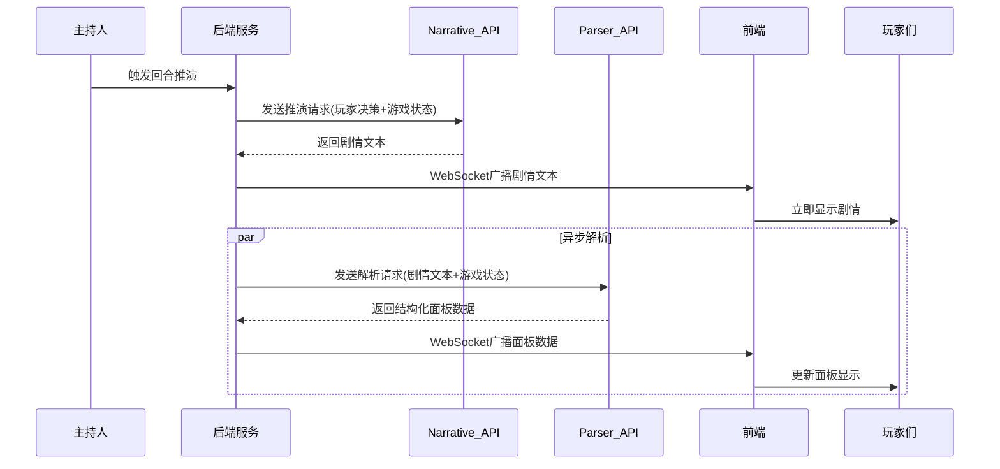

# Design Document: 双API架构重构

## Overview

本设计将现有的单一AI API调用流程重构为双API架构，实现"剧情推演"和"数据解析"的职责分离。核心思路是：

1. **Narrative_API** 专注生成流畅的剧情文本，不要求JSON格式输出
2. **Parser_API** 专注将剧情文本解析为结构化面板数据
3. 玩家在Narrative_API返回后立即看到剧情，无需等待解析完成
4. 面板数据异步更新，即使解析失败也不影响剧情展示

## Architecture



## Components and Interfaces

### 1. HostConfig 扩展

扩展现有的 `HostConfig` 模型，支持双API配置：

```typescript
interface HostConfigExtended {
  // 现有字段保持不变
  apiProvider: string | null;
  apiEndpoint: string | null;
  apiHeaders: Record<string, unknown> | null;
  apiBodyTemplate: Record<string, unknown> | null;
  
  // 新增：Parser API 配置（可选）
  parserApiProvider: string | null;
  parserApiEndpoint: string | null;
  parserApiHeaders: Record<string, unknown> | null;
  parserApiBodyTemplate: Record<string, unknown> | null;
  
  // 新增：是否启用双API模式
  dualApiEnabled: boolean;
}
```

### 2. AIService 重构

将现有的 `AIService` 拆分为两个核心方法：

```typescript
class AIService {
  // 剧情推演 - 返回纯文本
  async generateNarrative(
    config: AIConfig,
    request: InferenceRequest
  ): Promise<NarrativeResult>;
  
  // 数据解析 - 返回结构化数据
  async parseNarrativeToPanel(
    config: AIConfig,
    narrativeText: string,
    gameState: GameState
  ): Promise<PanelData>;
  
  // 完整推演流程（编排两个API调用）
  async performDualInference(
    narrativeConfig: AIConfig,
    parserConfig: AIConfig,
    request: InferenceRequest,
    onNarrativeReady: (narrative: string) => void
  ): Promise<TurnResult>;
}
```

### 3. NarrativeResult 接口

```typescript
interface NarrativeResult {
  sessionId: string;
  round: number;
  narrative: string;        // 纯文本剧情
  generatedAt: Date;
  status: 'completed' | 'failed';
  error?: string;
}
```

### 4. PanelData 接口

```typescript
interface PanelData {
  sessionId: string;
  round: number;
  roundTitle: string;
  perEntityPanel: EntityPanel[];
  leaderboard: LeaderboardEntry[];
  events: TurnEvent[];
  options: DecisionOption[];
  hexagram?: HexagramData;
  ledger?: LedgerData;
  riskCard?: string;
  opportunityCard?: string;
  benefitCard?: string;
  achievements?: Achievement[];
  cashFlowWarning?: CashFlowWarning[];
  nextRoundHints?: string;
  parsedAt: Date;
  status: 'completed' | 'failed' | 'pending';
  error?: string;
}
```

### 5. WebSocket 事件扩展

```typescript
// 新增事件类型
interface NarrativeReadyEvent {
  sessionId: string;
  round: number;
  narrative: string;
  timestamp: string;
}

interface PanelDataReadyEvent {
  sessionId: string;
  round: number;
  panelData: PanelData;
  timestamp: string;
}

interface PanelParseFailedEvent {
  sessionId: string;
  round: number;
  error: string;
  canRetry: boolean;
  timestamp: string;
}
```

### 6. 前端状态管理

```typescript
interface InferenceState {
  // 剧情状态
  narrativeStatus: 'idle' | 'loading' | 'ready' | 'error';
  narrativeText: string | null;
  narrativeError: string | null;
  
  // 面板状态
  panelStatus: 'idle' | 'loading' | 'ready' | 'error';
  panelData: PanelData | null;
  panelError: string | null;
  
  // 时间戳
  narrativeReadyAt: Date | null;
  panelReadyAt: Date | null;
}
```

## Data Models

### Prisma Schema 扩展

```prisma
model HostConfig {
  // 现有字段...
  
  // 新增 Parser API 配置
  parserApiProvider    String?
  parserApiEndpoint    String?
  parserApiHeaders     Json?
  parserApiBodyTemplate Json?
  dualApiEnabled       Boolean @default(false)
}

model InferenceResult {
  id            String   @id @default(cuid())
  sessionId     String
  round         Int
  
  // 剧情数据
  narrativeText String   @db.Text
  narrativeAt   DateTime
  
  // 面板数据（可为空，解析失败时）
  panelData     Json?
  panelAt       DateTime?
  panelStatus   String   @default("pending") // pending, completed, failed
  panelError    String?
  
  createdAt     DateTime @default(now())
  updatedAt     DateTime @updatedAt
  
  session       GameSession @relation(fields: [sessionId], references: [id])
  
  @@unique([sessionId, round])
}
```

## Correctness Properties

*A property is a characteristic or behavior that should hold true across all valid executions of a system-essentially, a formal statement about what the system should do. Properties serve as the bridge between human-readable specifications and machine-verifiable correctness guarantees.*

### Property 1: 配置路由正确性

*For any* HostConfig配置，当只配置一组API时，系统应使用该API同时处理剧情推演和数据解析；当配置两组API时，系统应分别使用对应API处理各自任务。

**Validates: Requirements 1.2, 1.3**

### Property 2: 剧情优先广播

*For any* 回合推演请求，当Narrative_API成功返回后，系统应在Parser_API返回之前或并行时广播剧情文本给所有玩家。剧情广播时间戳应早于或等于面板数据广播时间戳。

**Validates: Requirements 2.3, 3.1**

### Property 3: Narrative输出格式

*For any* Narrative_API调用，生成的Prompt不应包含JSON schema输出要求，返回结果应为纯文本剧情叙述。

**Validates: Requirements 2.1, 2.2**

### Property 4: Parser输出格式

*For any* Parser_API调用，输出应符合TurnResultDTO的JSON schema，包含perEntityPanel、leaderboard、events、options等必要字段。

**Validates: Requirements 3.3, 3.6**

### Property 5: Parser失败降级

*For any* Parser_API调用失败的情况，玩家已收到的剧情文本应保持可见且不受影响，系统应显示"数据更新中"状态并允许重试。

**Validates: Requirements 3.5, 6.2**

### Property 6: Narrative失败阻断

*For any* Narrative_API调用失败的情况，系统应阻止进入下一阶段，回合状态应保持不变，并提示重试。

**Validates: Requirements 2.5, 6.1**

### Property 7: 数据关联一致性

*For any* 成功的回合推演，存储的剧情文本和面板数据应关联到相同的sessionId和round，且面板数据应包含对应的回合号和时间戳。

**Validates: Requirements 7.1, 7.3**

### Property 8: 超时控制

*For any* Narrative_API调用，应在120秒内完成或超时；*For any* Parser_API调用，应在60秒内完成或超时。超时后应触发重试机制。

**Validates: Requirements 8.1, 8.2**

### Property 9: 指数退避重试

*For any* API调用超时或失败时，重试间隔应符合指数退避模式（如1s, 2s, 4s, 8s...），最大重试次数应有上限。

**Validates: Requirements 6.4**

### Property 10: 前端状态独立性

*For any* 前端状态更新，剧情状态(narrativeStatus)和面板状态(panelStatus)应独立管理，剧情ready时面板可以是loading状态。

**Validates: Requirements 4.2, 4.4, 5.1**

### Property 11: 历史数据保留

*For any* 面板数据解析失败的情况，前端应保留上一回合的面板数据，不应清空显示。

**Validates: Requirements 5.3**

### Property 12: 缓存有效性

*For any* 推演结果，系统应缓存最近的结果以支持快速回顾，缓存应包含完整的剧情文本和面板数据。

**Validates: Requirements 8.5**

## Error Handling

### Narrative_API 失败处理

```typescript
async function handleNarrativeFailure(
  sessionId: string,
  round: number,
  error: Error
): Promise<void> {
  // 1. 记录错误日志
  logger.error('Narrative API failed', { sessionId, round, error });
  
  // 2. 广播错误状态
  io.to(sessionId).emit('narrative_failed', {
    sessionId,
    round,
    error: error.message,
    canRetry: true,
  });
  
  // 3. 保持回合状态为 'inferring'，允许重试
  // 不自动进入下一阶段
}
```

### Parser_API 失败处理

```typescript
async function handleParserFailure(
  sessionId: string,
  round: number,
  narrativeText: string,
  error: Error
): Promise<void> {
  // 1. 记录错误日志
  logger.error('Parser API failed', { sessionId, round, error });
  
  // 2. 保存剧情文本（即使解析失败）
  await saveInferenceResult(sessionId, round, {
    narrativeText,
    panelStatus: 'failed',
    panelError: error.message,
  });
  
  // 3. 广播解析失败状态
  io.to(sessionId).emit('panel_parse_failed', {
    sessionId,
    round,
    error: error.message,
    canRetry: true,
  });
  
  // 4. 允许游戏继续（玩家可阅读剧情）
  // 主持人可手动触发重新解析
}
```

## Testing Strategy

### 单元测试

1. **AIService.generateNarrative**
   - 测试正常返回纯文本剧情
   - 测试超时处理
   - 测试重试逻辑

2. **AIService.parseNarrativeToPanel**
   - 测试正常解析JSON输出
   - 测试解析失败处理
   - 测试不完整数据处理

3. **配置兼容性**
   - 测试单API配置模式
   - 测试双API配置模式
   - 测试配置切换

### 集成测试

1. **完整推演流程**
   - 测试剧情优先广播
   - 测试面板异步更新
   - 测试错误降级

2. **WebSocket事件**
   - 测试narrative_ready事件
   - 测试panel_data_ready事件
   - 测试错误事件

### 属性测试

1. **Property 1**: 剧情优先广播
   - 生成随机推演请求，验证剧情广播时间早于面板广播

2. **Property 2**: 面板解析独立性
   - 模拟Parser_API失败，验证剧情仍可见

3. **Property 3**: 配置向后兼容
   - 使用单API配置，验证行为与旧版一致

4. **Property 4**: 数据关联一致性
   - 验证存储的剧情和面板数据关联正确

5. **Property 5**: 超时控制
   - 模拟慢响应，验证超时机制生效
